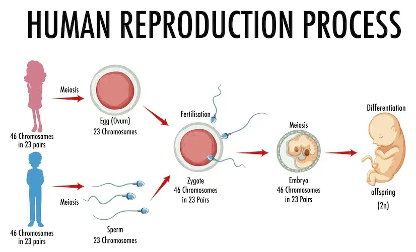
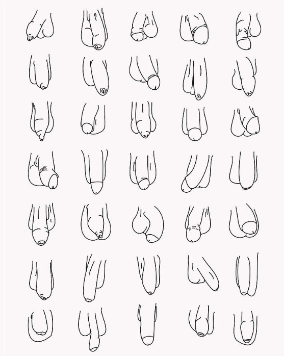
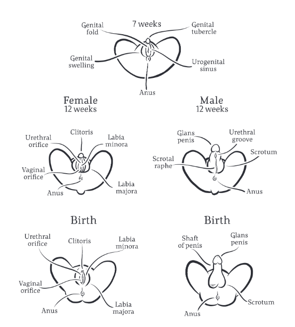
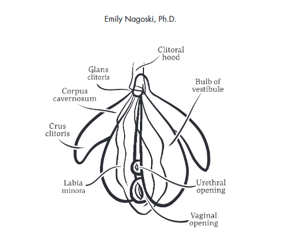
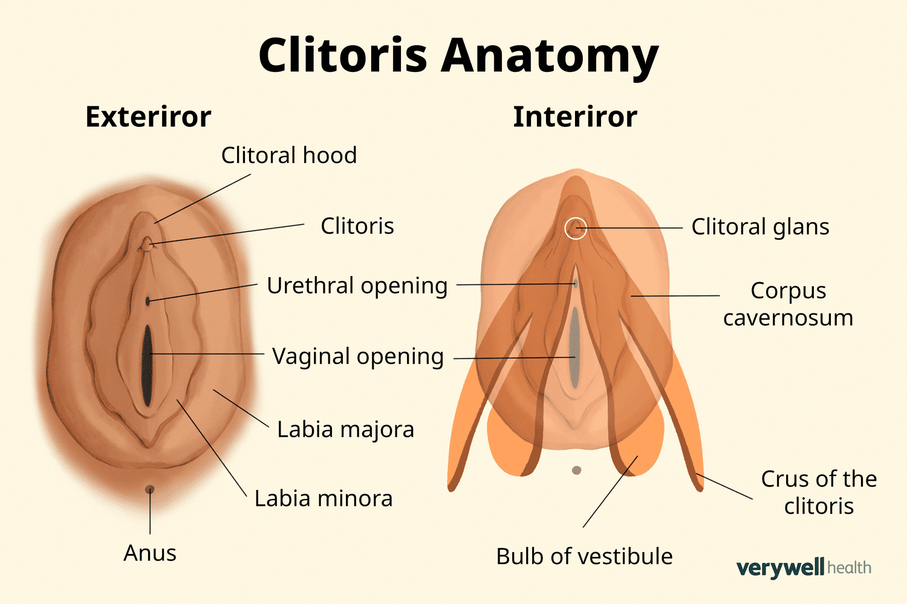
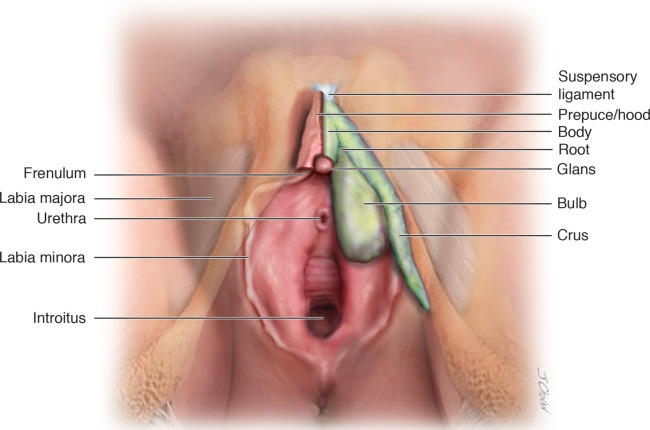

<h1 align="center">Come as you are (emily-nagoski)</h1>

  
  

- [Introduction: Yes, You Are Normal](#introduction-yes-you-are-normal)
  - [The True Story of Sex:](#the-true-story-of-sex)
- [Part 1: The (Not-So-Basic) Basics](#part-1-the-not-so-basic-basics)
  - [Anatomy](#anatomy)
    - [The Beginning:](#the-beginning)
    - [The Clit, The Whole Clit, and Nothing but the Clit:](#the-clit-the-whole-clit-and-nothing-but-the-clit)
    - [Hymen Truths:](#hymen-truths)
    - [A Word on Words:](#a-word-on-words)
    - [The Sticky Bits:](#the-sticky-bits)
    - [Intersex Parts:](#intersex-parts)
    - [Why it Matters:](#why-it-matters)
    - [Change How You See:](#change-how-you-see)
    - [A Better Metaphor:](#a-better-metaphor)
    - [What it is, Not what it Means:](#what-it-is-not-what-it-means)
  - [The Dual Control Model:](#the-dual-control-model)
    - [Turn on the ons, turn off the offs:](#turn-on-the-ons-turn-off-the-offs)
    - [Arousability:](#arousability)
    - [What medium means](#what-medium-means)
    - [different for girls, but not necessarily](#different-for-girls-but-not-necessarily)
    - [What turns you on](#what-turns-you-on)
    - [All the same parts, organized in different ways](#all-the-same-parts-organized-in-different-ways)
    - [can you change your SSI or SES](#can-you-change-your-ssi-or-ses)
  - [Context:](#context)
    - [Sensation in Context](#sensation-in-context)
    - [sex, rats, and rock n roll](#sex-rats-and-rock-n-roll)
    - [you emotional one ring](#you-emotional-one-ring)
    - [is something wrong with me](#is-something-wrong-with-me)
- [Part 2: Sex in Context](#part-2-sex-in-context)
  - [Emotional Context:](#emotional-context)
    - [The stress response cycle: fight, flight, and freeze](#the-stress-response-cycle-fight-flight-and-freeze)
    - [stress and sex](#stress-and-sex)
    - [Broken culture: Broken stress response cycle](#broken-culture-broken-stress-response-cycle)
    - [complete the cycle](#complete-the-cycle)
    - [when sex becomes the lion](#when-sex-becomes-the-lion)
    - [sex  and the survivor](#sex--and-the-survivor)
    - [origin of love](#origin-of-love)
    - [The science of falling in love](#the-science-of-falling-in-love)
    - [Attachment and sex: The dark side](#attachment-and-sex-the-dark-side)
    - [Attachment and Sex: Sex that advances the plot](#attachment-and-sex-sex-that-advances-the-plot)
    - [Attachment Style](#attachment-style)
    - [Managing attachment: Your feels as a sleepy hedgehog](#managing-attachment-your-feels-as-a-sleepy-hedgehog)
    - [Survival of the social](#survival-of-the-social)
    - [The water of life](#the-water-of-life)
  - [Cultural Context:](#cultural-context)
    - [Three messages](#three-messages)
    - [your are beautiful](#your-are-beautiful)
    - [criticizing yourself = stress = reduces sexual pleasure](#criticizing-yourself--stress--reduces-sexual-pleasure)
    - [health at every size](#health-at-every-size)
    - [dirty](#dirty)
    - [when somebody yucks your yum](#when-somebody-yucks-your-yum)
    - [maximizing Yum ... wth science! part 1: Self-Compassion](#maximizing-yum--wth-science-part-1-self-compassion)
    - [maximizing Yum ... wth science! part 1: cognitive Dissonance](#maximizing-yum--wth-science-part-1-cognitive-dissonance)
    - [maximizing Yum ... wth science! part 1: Media Nutrition](#maximizing-yum--wth-science-part-1-media-nutrition)
    - [You do you](#you-do-you)
- [Part 3: Sex in Action](#part-3-sex-in-action)
  - [Arousal:](#arousal)
    - [Measuring and defining Nonconcordance](#measuring-and-defining-nonconcordance)
    - [All the same parts, Organized in different ways: "This is a restaurant"](#all-the-same-parts-organized-in-different-ways-this-is-a-restaurant)
    - [Nonconcordance in other emotions](#nonconcordance-in-other-emotions)
    - [Lubrication Error #1: Genital Response = 'turned on'](#lubrication-error-1-genital-response--turned-on)
    - [Lubrication Error #2: Genital Response is enjoying](#lubrication-error-2-genital-response-is-enjoying)
    - [Lubrication Error #3: Nonconcordance is a problem](#lubrication-error-3-nonconcordance-is-a-problem)
    - [Medication away the brakes](#medication-away-the-brakes)
    - [Honey.. i'm nonconcordant](#honey-im-nonconcordant)
    - [Ripe Fruit](#ripe-fruit)
  - [Desire:](#desire)
    - [Desire = arousal in context](#desire--arousal-in-context)
    - [Not a drive. for Real](#not-a-drive-for-real)
    - [Why it matters that it's not a drive](#why-it-matters-that-its-not-a-drive)
    - [But emily, sometimes it feels like a drive](#but-emily-sometimes-it-feels-like-a-drive)
    - [Impatient little monitors](#impatient-little-monitors)
    - [Good news! it's probably not your hormones](#good-news-its-probably-not-your-hormones)
    - [More good news! It's not Monogamy either](#more-good-news-its-not-monogamy-either)
    - [Isn't it just culture](#isnt-it-just-culture)
    - [It might be the chasing dynamic](#it-might-be-the-chasing-dynamic)
    - [Maximizing Desire...with science! part 1: Arousing the one ring](#maximizing-desirewith-science-part-1-arousing-the-one-ring)
    - [Maximizing Desire...with science! part 2: Turning off the offs](#maximizing-desirewith-science-part-2-turning-off-the-offs)
    - [Maximizing Desire...with science! part 3: Desperate Measures](#maximizing-desirewith-science-part-3-desperate-measures)
    - [Sharing Your garden](#sharing-your-garden)
- [Part 4: Ecstasy for Everyday](#part-4-ecstasy-for-everyday)
  - [Orgasm:](#orgasm)
    - [Nonconcordance - Now with orgasms](#nonconcordance---now-with-orgasms)
    - [No two alike](#no-two-alike)
    - [all the same parts](#all-the-same-parts)
    - [Your vagina's okay, either way](#your-vaginas-okay-either-way)
    - [The evolution of the fantastic bonus](#the-evolution-of-the-fantastic-bonus)
    - [Difficulty with orgasm](#difficulty-with-orgasm)
    - [Ecstatic orgasm: you're a flock](#ecstatic-orgasm-youre-a-flock)
    - [How do you medicate a flock](#how-do-you-medicate-a-flock)
    - [Flying toward ecstasy](#flying-toward-ecstasy)
  - [Meta-Emotions](#meta-emotions)
    - [can't get no](#cant-get-no)
    - [The map and the terrain](#the-map-and-the-terrain)
    - [positive meta-emotions step 1: Trust the terrain](#positive-meta-emotions-step-1-trust-the-terrain)
    - [positive meta-emotions step 2: Let go of the map(the hard part)](#positive-meta-emotions-step-2-let-go-of-the-mapthe-hard-part)
    - [how to let go: nonjudging](#how-to-let-go-nonjudging)
    - [nonjudging = "emotion coaching"](#nonjudging--emotion-coaching)
    - [Nonjudging: tips for beginners](#nonjudging-tips-for-beginners)
    - [No good reason](#no-good-reason)
    - [Healing trauma with nonjudging](#healing-trauma-with-nonjudging)
    - [When partners dismiss](#when-partners-dismiss)
    - [Influencing the little monitor part 1: Changing your criterion velocity](#influencing-the-little-monitor-part-1-changing-your-criterion-velocity)
    - [Influencing the little monitor part 2: Changing the kind of effort](#influencing-the-little-monitor-part-2-changing-the-kind-of-effort)
    - [Influencing the little monitor part 3: Changing the goal](#influencing-the-little-monitor-part-3-changing-the-goal)
    - [To feel normal](#to-feel-normal)
    - [this is it](#this-is-it)

# Introduction: Yes, You Are Normal 

## The True Story of Sex:

**Unknown Words:**
- reliably = 
- breast stimulation = 
- toe socking = 
- spontaneous = 
- emerges = 
- erotic =

**Good to Know:**
- spontaneous sexual desire = 
- Responsive sexual desire = 

- It was just sort of assumed that men have orgasms during penis-in-vagina sex (Intercourse), women should have orgasms with intercourse too. In reality, About **30 percent** of women orgasm reliably with intercourse. The **others 70** percent sometimes, rarely, or never orgasm with intercourse, and they're all healthy and normal. A woman might orgasm lots of others ways (e,g,. oral sex, vibrators, breast stimulation, toe socking) pretty much any way you can imagine. That's normal.

- It was also assumed that because men experience spontaneous, out-of-the-blue desire for sex, women should also want sex spontaneously. A woman can be perfectly normal and healthy and never experience spontaneous sexual desire. Instead, she may experience “responsive” desire, in which her desire emerges only in a highly erotic context.

# Part 1: The (Not-So-Basic) Basics

## Anatomy

### The Beginning:

Clink the image to watch the video:

Look at the image, all the same parts, just organized in different ways. Every body's genitals are the same until six weeks.

### The Clit, The Whole Clit, and Nothing but the Clit:

- The clitoris is the primary and most sensitive organ responsible for sexual pleasure in female anatomy. 
- Unlike the penis, which has multiple functions (sensation, penetration, ejaculation, urination), the clitoris is specialized purely for sensation.

### Hymen Truths:
### A Word on Words:
### The Sticky Bits:
### Intersex Parts:
### Why it Matters:   
### Change How You See: 
### A Better Metaphor: 
### What it is, Not what it Means:

## The Dual Control Model:

### Turn on the ons, turn off the offs: 
### Arousability: 
### What medium means
### different for girls, but not necessarily
### What turns you on
### All the same parts, organized in different ways
### can you change your SSI or SES 

## Context:

### Sensation in Context
### sex, rats, and rock n roll
### you emotional one ring
### is something wrong with me

# Part 2: Sex in Context

## Emotional Context:
### The stress response cycle: fight, flight, and freeze
### stress and sex
### Broken culture: Broken stress response cycle
### complete the cycle
### when sex becomes the lion
### sex  and the survivor
### origin of love
### The science of falling in love
### Attachment and sex: The dark side
### Attachment and Sex: Sex that advances the plot
### Attachment Style
### Managing attachment: Your feels as a sleepy hedgehog
### Survival of the social
### The water of life

## Cultural Context:
### Three messages
### your are beautiful
### criticizing yourself = stress = reduces sexual pleasure
### health at every size
### dirty
### when somebody yucks your yum
### maximizing Yum ... wth science! part 1: Self-Compassion
### maximizing Yum ... wth science! part 1: cognitive Dissonance
### maximizing Yum ... wth science! part 1: Media Nutrition
### You do you

# Part 3: Sex in Action

## Arousal:
### Measuring and defining Nonconcordance
### All the same parts, Organized in different ways: "This is a restaurant"
### Nonconcordance in other emotions
### Lubrication Error #1: Genital Response = 'turned on'
### Lubrication Error #2: Genital Response is enjoying
### Lubrication Error #3: Nonconcordance is a problem
### Medication away the brakes
### Honey.. i'm nonconcordant
### Ripe Fruit

## Desire:
### Desire = arousal in context
### Not a drive. for Real
### Why it matters that it's not a drive
### But emily, sometimes it feels like a drive
### Impatient little monitors
### Good news! it's probably not your hormones
### More good news! It's not Monogamy either
### Isn't it just culture
### It might be the chasing dynamic
### Maximizing Desire...with science! part 1: Arousing the one ring
### Maximizing Desire...with science! part 2: Turning off the offs
### Maximizing Desire...with science! part 3: Desperate Measures
### Sharing Your garden

# Part 4: Ecstasy for Everyday

## Orgasm: 
### Nonconcordance - Now with orgasms
### No two alike
### all the same parts
### Your vagina's okay, either way
### The evolution of the fantastic bonus
### Difficulty with orgasm
### Ecstatic orgasm: you're a flock
### How do you medicate a flock
### Flying toward ecstasy

## Meta-Emotions
### can't get no
### The map and the terrain
### positive meta-emotions step 1: Trust the terrain
### positive meta-emotions step 2: Let go of the map(the hard part)
### how to let go: nonjudging
### nonjudging = "emotion coaching"
###  Nonjudging: tips for beginners
### No good reason
### Healing trauma with nonjudging
### When partners dismiss
### Influencing the little monitor part 1: Changing your criterion velocity
### Influencing the little monitor part 2: Changing the kind of effort
### Influencing the little monitor part 3: Changing the goal
### To feel normal
### this is it